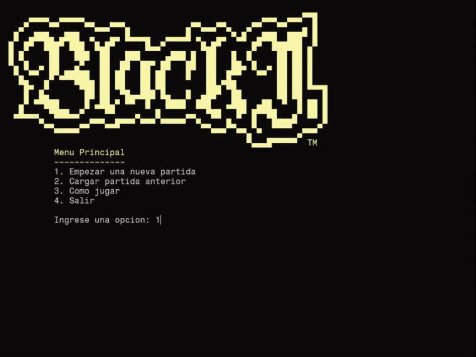

# [ BlackJack ] 🃏
*Proyecto del curso Fundamentos de Programación Orientada a Objetos (FPOO) de la Universidad del Valle.*

Juego de BlackJack clásico desarrollado en C++ aplicando los conceptos y temas aprendidos en clase.

## ⭐ Features
* 💾 Guardardo y cargado de partida
* 📂 Estructura MCV
* 🎨 Arte ASCII atractivo

## 🛠️ Estructura del proyecto
* `controlador/`
    * `Controlador.cpp`: Gestiona inputs e interacciones
* `modelos/`
    * `Apuesta.cpp`: Manejar economía de jugador
    * `Carta.cpp`: Representa cartas con atributos como palo y valor
    * `Mazo.cpp`: Contiene objetos `Carta` y los maneja
    * `Participante.cpp`: Superclase de jugador y crupier
    * `Crupier.cpp`: Distribuye cartas y decide la partida
    * `Jugador.cpp`: Maneja su mano y su nombre para el guardado
    * `Serializador.cpp`: Serializa los datos de partida para guardado/cargado
* `vista/`
    * `Vista.cpp`: Renderizar todo el juego
* `main.cpp`: Lógica y búcle principal de juego

## 📝 Notas
* Requiere UNICODE para que el arte ASCII se vea correctamente
* Fuente de la terminal en el `showCase.gif`: fragment mono
* El proyecto no requiere dependencias

## 👥 Integrantes
* Yostin Ramirez - 2519674
* Lesly Zapata - 2516574
* Joseph Terreros - 2521011
* Juan Manuel Rosero - 2520822
* Juan Esteban Mina - 2518466

